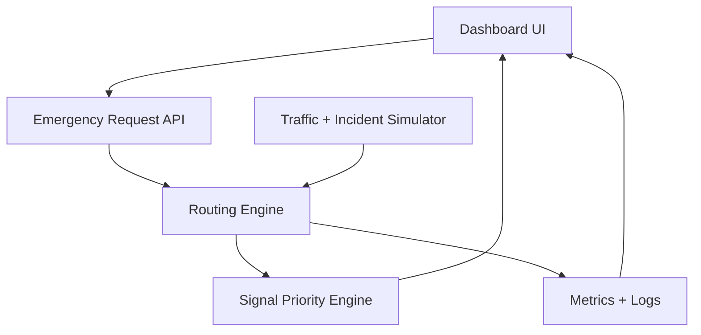

# Architecture

## High-Level Architecture

## Components

### Dashboard UI

Shows the map, ambulance, route, signals, incidents, and metrics.

### Emergency Request API

Creates and manages active ambulance requests.

### Road Graph

Represents junctions as nodes and roads as edges. Each edge stores distance, base travel time, congestion, and blocked status.

### Routing Engine

Calculates the best path using Dijkstra or A*. Road cost increases when congestion is high and becomes unavailable when blocked.

### Signal Priority Engine

Finds signals on the active route and simulates green priority as the ambulance approaches each junction.

### Incident Simulator

Allows accidents, blocked roads, and congestion spikes to be added during the demo.

### Metrics Engine

Tracks ETA, route changes, signals coordinated, stopped time, and emergency completion status.

## Data Flow

1. User starts emergency request.
2. Backend reads current road conditions.
3. Routing engine calculates best route.
4. Dashboard displays route and ETA.
5. Ambulance simulation begins.
6. Signal engine activates upcoming junctions.
7. Incident changes trigger route recalculation.
8. Dashboard updates metrics and status.

