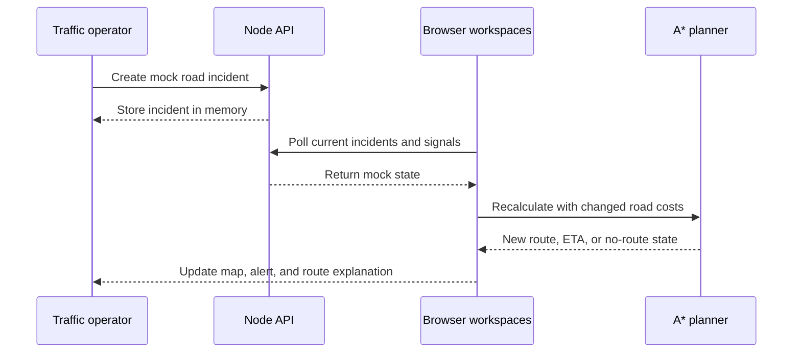

# VIALERT

VIALERT is a local emergency mobility **simulation**. It shows an ambulance route, lets a traffic operator change mock signals and incidents, and explains predicted congestion on a small Bengaluru-inspired road graph. The demo is designed for repeatable presentations; it does not connect to real ambulances, traffic lights, GPS, or live traffic feeds.

## Current status

The repository contains a working browser demo with four workspaces, an Express mock API, and a FastAPI forecast service. The driver and operator views use the same fictional graph and show the effects of simulated incidents on route choice and ETA. The traffic forecast is a transparent rules calculation with a matching browser fallback.

Live in this repository: route guidance, stepped and timed ambulance movement, scenario replay, mock incident and signal controls, operator alerts, forecast overlays, a guided reset, and OpenStreetMap or SVG map display. Planned integrations such as real dispatch, GPS, traffic hardware, a database, and WebSockets are not implemented.

## What you can do

| Workspace | URL | What it shows |
| --- | --- | --- |
| Demo guide | `/demo` | A guided presentation and a reset that restores the demo baseline. |
| Ambulance driver | `/ambulance` | Hospital selection, A* route, trip progress, ETA, next turn, signal awareness, and optional browser voice guidance. |
| Traffic operations | `/traffic` | Demo fleet, map, alerts, incident desk, mock signal controls, and future congestion risk. |
| Simulation | `/simulation` | A timed or stepped ambulance journey, scenario controls, reroutes, event timeline, map, and perspective camera scenes. |

The maps use Leaflet with OpenStreetMap tiles when available and fall back to an SVG view of the same city graph. Map and Follow ambulance use map camera modes; Driver, Third-person, and Rear-view render interactive 3D-style perspective scenes from the simulation state. These views are presentation tools, not vehicle cameras.

## Architecture at a glance

```text
User
  │
  ▼
React + Vite frontend (frontend/)
  ├── /demo ─────────── guided presentation and reset
  ├── /ambulance ────── driver route, ETA, and signals
  ├── /traffic ──────── fleet, incidents, alerts, and forecasts
  ├── /simulation ───── timed journey and scenario replay
  │
  ├── Browser A* planner ─── route and road-cost calculation
  ├── Browser storage ────── same-browser journey and settings
  ├── /api/* ── Vite proxy ──► Express API (backend/server-node/)
  │                           └── city data + disposable operations state
  └── /ai/* ── Vite proxy ───► FastAPI (backend/server-ai/)
                              └── deterministic forecast rules

shared-data/ JSON fixtures ───► frontend + Express API + FastAPI
```

The frontend owns the simulation clock, ambulance movement, and A* route calculation. Congestion, incidents, closures, mock priority signals, and optional forecast costs affect the route; closed roads are excluded. The latest simulation snapshot and forecast settings are shared through storage in the **same browser profile**.

Express serves city data and holds mock signal changes, incidents, emergencies, alerts, and events in process memory. FastAPI calculates explainable traffic forecasts without storing requests. Both services read the fictional fixtures in `shared-data/`; neither writes changes back to those JSON files. When a service is unavailable, the frontend labels its local city-data or forecast fallback. The app does not synchronize journeys across devices.

### Example: an incident changes a route



The Simulation page can also activate local scenario presets. Its current journey is published through browser storage for the other pages in that browser. The Node service records mock simulation status and incidents, but does not advance the browser clock or calculate routes.

## Main code areas

The **frontend** starts at `frontend/src/main.tsx`. `frontend/src/app/routes.tsx` connects the four pages, `frontend/src/services/apiClient.ts` calls both APIs, `frontend/src/features/ambulance/ambulanceData.ts` implements the graph route planner, and `frontend/src/features/simulation/simulationEngine.ts` advances the local journey. The traffic and prediction features assemble operator state and forecasts; reusable maps and layout live in `frontend/src/components/`.

The **backend** has two independent services. `backend/server-node/src/app.js` mounts the Express API, `src/routes/api.js` declares endpoints, and `src/data/store.js` loads JSON fixtures into a disposable store. `backend/server-ai/app/main.py` declares FastAPI endpoints, `model.py` scores deterministic forecasts, and `schemas.py` validates inputs. The services do not share a database; both read fixture files from `shared-data/`.

## Repository structure

```text
VIALERT/
├── frontend/                         # React, TypeScript, Vite, and browser UI
│   ├── src/app/                      # App shell and browser routes
│   ├── src/pages/                    # Demo, ambulance, traffic, simulation pages
│   ├── src/features/
│   │   ├── ambulance/                # Driver journey and A* planner
│   │   ├── traffic/                  # Operator dashboard and controls
│   │   ├── simulation/               # Scenario engine, maps, camera scenes
│   │   ├── routing/                  # Incidents and dynamic road costs
│   │   ├── prediction/               # Forecast UI and local rule fallback
│   │   └── demo/                     # Guided reset
│   ├── src/components/              # Reusable UI and maps
│   ├── src/services/                # HTTP API client and socket placeholder
│   ├── src/styles/                  # Shared CSS
│   ├── public/                      # Static assets
│   └── vite.config.ts               # Local server and API proxies
├── backend/
│   ├── server-node/                  # Express mock operations API
│   │   ├── src/routes/               # HTTP endpoints
│   │   ├── src/services/             # Emergency, signal, incident logic
│   │   ├── src/data/                 # In-memory store
│   │   └── test/                     # API checks
│   └── server-ai/                    # FastAPI forecast API
│       ├── app/main.py               # HTTP endpoints
│       ├── app/model.py              # Deterministic scoring
│       ├── app/schemas.py            # Request and response models
│       └── tests/                    # Forecast checks
├── docs/
│   ├── README.md                     # Documentation index
│   ├── PROJECT_OVERVIEW.md           # MVP vision
│   ├── 00-simulation-demo/           # Scenarios and engine notes
│   ├── 01-ambulance-dashboard/       # Driver requirements
│   ├── 02-traffic-incharge-dashboard/ # Operator requirements
│   ├── 03-ai-traffic-prediction/     # Forecast design
│   ├── 04-backend-realtime/          # API contract and realtime proposal
│   ├── 05-map-data-routing/          # Graph data and A* notes
│   └── 06-project-management/        # Build plan, demo script, file map
├── shared-data/                     # Fictional city graph and forecast inputs
├── scripts/                         # Data and running-service checks
├── package.json                     # Root commands and npm workspaces
└── README.md                        # Project guide
```

**Where to put new work:** Put browser pages, components, hooks, and styling in `frontend/`. Put Express API work in `backend/server-node/` and forecast service work in `backend/server-ai/`. Put project explanations, contracts, demo scripts, and design notes in `docs/`. Put shared fictional JSON fixtures in `shared-data/`, and root-level tooling in `scripts/`. See the [detailed file map](docs/06-project-management/FILE_STRUCTURE.md).

## Run locally

Prerequisites: Node.js **22.12+**, npm, Python **3.11+**, and [uv](https://docs.astral.sh/uv/getting-started/installation/). No API keys, database, or paid service are needed.

From the repository root:

```bash
npm ci
npm run setup:ai
npm run dev
```

`npm run dev` starts the frontend and both APIs. Stop all three with Ctrl+C. To run them in separate terminals, use `npm run dev:frontend`, `npm run dev:node`, and `npm run dev:ai`.

| Process | Local address | Purpose |
| --- | --- | --- |
| Frontend | [http://localhost:5173/demo](http://localhost:5173/demo) | Browser workspaces and local simulation. |
| Node API | [http://127.0.0.1:4000/api/health](http://127.0.0.1:4000/api/health) | Mock operations and city data. |
| AI API | [http://127.0.0.1:8000/health](http://127.0.0.1:8000/health) | Deterministic traffic forecasts. |
| AI API explorer | [http://127.0.0.1:8000/docs](http://127.0.0.1:8000/docs) | Interactive FastAPI contract. |

Vite proxies `/api/*` to Node and `/ai/*` to FastAPI, removing `/ai` before forwarding. `/` opens `/demo`; unknown browser routes redirect to `/ambulance`. The frontend uses port 5173, Node uses 4000, and FastAPI uses 8000. Optional settings are in [`frontend/.env.example`](frontend/.env.example) and [`backend/server-node/.env.example`](backend/server-node/.env.example). FastAPI accepts a `CORS_ORIGINS` environment variable. The frontend production bundle is written to `frontend/dist/`.

## A quick demo flow

1. Open `/demo` and select **Start judge demo** to reset the current demo state.
2. In `/ambulance`, choose a hospital and start the simulated journey. Inspect the route, ETA, and upcoming signals.
3. In `/simulation`, step the ambulance and activate the road blockage or accident scenario on `R3 · Central–Koramangala Link`. The A* route and timeline explain the change.
4. In `/traffic`, inspect the ambulance, incident, alert, and route. Change a mock signal or create another incident. The traffic page also shows future risk scores for six corridors.
5. Use **Reset demo** in any workspace to return the browser and available Node API to their baseline. If Node is offline, the browser resets locally and reports that the backend reset was partial.

The [judge demo script](docs/06-project-management/DEMO_SCRIPT.md) has exact clicks and recovery steps. Simulation and Traffic should be open in the **same browser profile** to share live journey progress.

## Data and API ownership

| Data or action | Source and lifetime |
| --- | --- |
| Nodes, roads, adjacency, signals, hospitals, bases, vehicles, scenarios, forecast examples | JSON in `shared-data/`; committed fixtures. |
| Ambulance movement, active simulation scenarios, event timeline | Frontend state; the latest journey snapshot is shared in the same browser profile. |
| Operator incidents, mock signal changes, emergencies, alerts, operator events | Node process memory; cleared by reset or server restart. |
| Forecast settings and offline incident fallback | Browser storage for the same browser profile. |
| Forecast responses | Calculated by FastAPI rules or the labeled frontend fallback; no forecast database. |

The main Node endpoints are `GET /api/city`, `GET /api/vehicles`, `GET /api/signals`, `PATCH /api/signals/:signalId`, `GET/POST /api/incidents`, `DELETE /api/incidents/:incidentId`, and the simulation/reset and operations endpoints. The AI endpoints include `POST /predict/forecast` and `POST /predict/batch`. See the [Node API reference](backend/server-node/README.md), [AI API reference](backend/server-ai/README.md), and [combined API inventory](docs/04-backend-realtime/API_SPEC.md).

## Project documentation

All topic guides live under [`docs/`](docs/README.md):

| Folder | Contents |
| --- | --- |
| [`00-simulation-demo`](docs/00-simulation-demo/README.md) | Scenarios, replay behavior, simulation engine. |
| [`01-ambulance-dashboard`](docs/01-ambulance-dashboard/README.md) | Driver features and UI requirements. |
| [`02-traffic-incharge-dashboard`](docs/02-traffic-incharge-dashboard/README.md) | Operator features and UI requirements. |
| [`03-ai-traffic-prediction`](docs/03-ai-traffic-prediction/README.md) | Forecast design, inputs, and model contract. |
| [`04-backend-realtime`](docs/04-backend-realtime/README.md) | API contracts and proposed realtime events. |
| [`05-map-data-routing`](docs/05-map-data-routing/README.md) | City data format and A* routing rules. |
| [`06-project-management`](docs/06-project-management/FILE_STRUCTURE.md) | File map, build plan, acceptance criteria, demo script. |

The detailed [shared-data guide](shared-data/README.md) explains fixture IDs and editing rules. Some design documents describe the broader MVP vision; the runtime behavior in this README and the service READMEs describes what is currently implemented. The WebSocket event document is a proposal: `frontend/src/services/socketClient.ts` is a reserved stub, and the current app uses polling and browser storage.

## Available commands

```bash
npm run build        # TypeScript and Vite production build
npm run test:data    # Check fixture graph integrity
npm run test:frontend # Frontend checks
npm run test:node    # Node API checks
npm run test:ai      # FastAPI checks
npm run check        # Build and all checks
npm run smoke        # Read-only service checks while npm run dev is running
```

All roads, destinations, congestion values, predictions, and signal controls in this repository are **demo data**. The project has no production dispatch, real signal integration, live GPS feed, database, WebSocket service, or trained prediction model.
